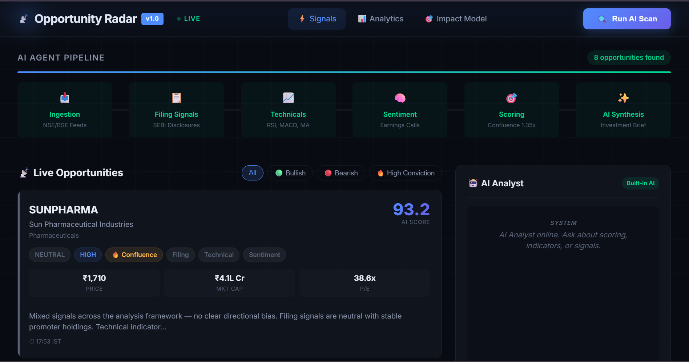

# Opportunity Radar 🚀

AI-powered FinTech dashboard that uses a multi-agent pipeline to detect high-confidence financial opportunities.

---

🌍 Problem Statement

Managing multiple opportunities manually can be overwhelming and inefficient. Important details can be missed, and tracking progress becomes difficult.

Opportunity Radar solves this by providing a centralized and structured system to track and analyze opportunities effectively.

---

✨ Key Features

 -🔍 Track jobs, internships, and opportunities
 - 📊 Organized data management system
 -📌 Easy-to-use dashboard
 -⚡ Fast and responsive interface
 -📁 Structured storage of opportunity details
 - 🧠 Smart filtering and organization

---

## 🖥️ What You Will See

- AI Agent Pipeline visualization  
- Signals from:
  - Technical indicators  
  - Sentiment analysis  
  - Filing data  
- Final classification:
  - Bullish  
  - Bearish  
  - High Conviction opportunities  

---

🧠 Tech Stack

  -Python
  -Flask / PyQt (based on implementation)
  -HTML, CSS
  -JSON / Data Handling
  
---

⚙️ How It Works

1.User adds opportunity details
2.System stores data in structured format
3.Data is processed and organized
4.Dashboard displays opportunities clearly
5.User tracks and manages progress efficiently 

---

## 📸 Demo

---
## 📊 Sample Output

Example opportunity generated by the system:

- Stock: RELIANCE  
- Signal: Bullish 📈  
- Confidence: High  
- Reason:
  - Positive sentiment  
  - Strong technical indicators  
  - Favorable filings  

This demonstrates how the AI pipeline identifies high-confidence opportunities.

---

## 🚀 Future Improvements

- 🤖 AI-based opportunity recommendations  
- 🌐 Web deployment  
- 📱 Mobile support  
- 📊 Advanced analytics dashboard

---

🔧 Installation
git clone https://github.com/GVethaNarayanan/opportunity-radar-final.git
cd opportunity-radar-final
pip install -r requirements.txt

---

## 👨‍💻 Developed by

Vetha Narayanan
